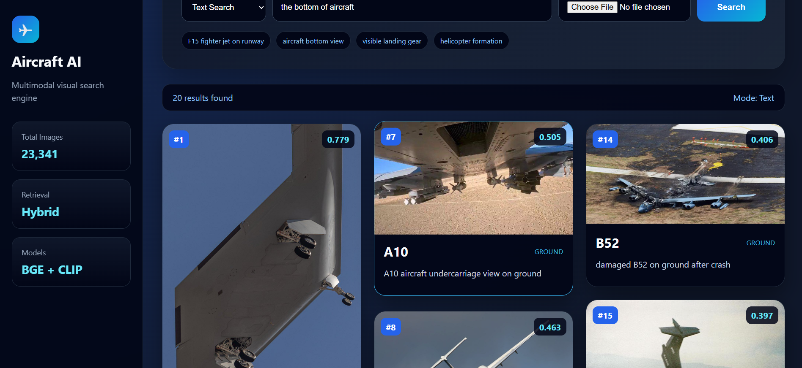
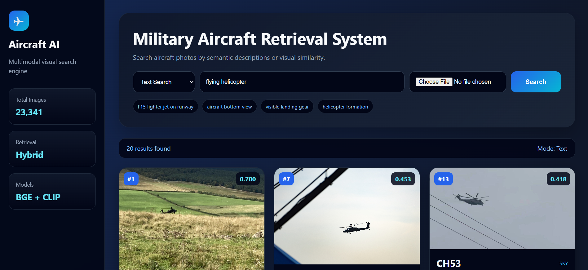
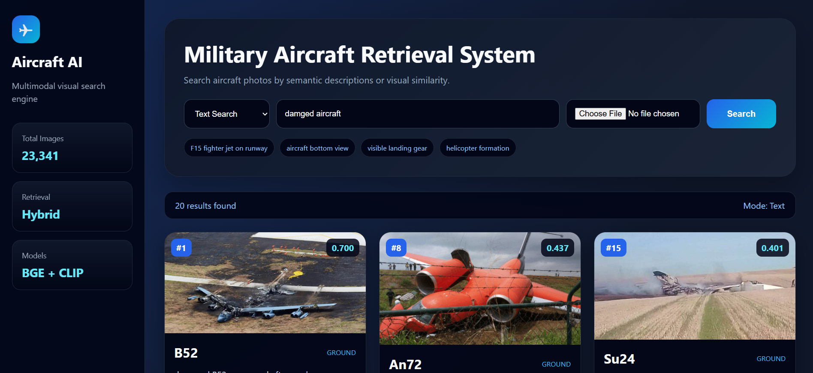

# ✈️ Military Aircraft Retrieval System

An AI-powered visual search engine for retrieving military aircraft images using natural language descriptions.

The system combines **Qwen2.5-VL**, **BGE embeddings**, **CLIP image embeddings**, **FAISS vector databases**, and a modern **Flask** web interface to provide fast semantic image retrieval.

---

# Demo Video

https://github.com/user-attachments/assets/YOUR_VIDEO_LINK

*(Replace with the uploaded GitHub video link after uploading.)*

---

# Overview

Searching through tens of thousands of aircraft images manually is extremely time-consuming.

This project allows users to search military aircraft photographs using natural language queries such as:

```
F15 fighter jet on runway
```

```
aircraft bottom view
```

```
visible landing gear wheels under aircraft
```

```
helicopter flying in formation
```

```
crashed aircraft
```

The system retrieves the most semantically relevant aircraft images ranked by similarity.

---

# Features

- AI-powered semantic image retrieval
- Natural language search
- Hybrid Retrieval (Text + CLIP)
- Automatic metadata generation
- FAISS vector search
- Interactive Flask interface
- Large image preview
- Fast retrieval over thousands of aircraft images

---

# Pipeline

```
Dataset

↓

Qwen2.5-VL

↓

Automatic Metadata

↓

BGE Embeddings

↓

FAISS Text Index

↓

CLIP Image Embeddings

↓

FAISS Image Index

↓

Hybrid Retrieval

↓

Flask Web Interface
```

---

# System Architecture

```
               User Query
                    │
                    ▼
          Text Embedding (BGE)
                    │
                    ▼
            Text FAISS Search
                    │
                    ▼
         CLIP Image Similarity
                    │
                    ▼
           Hybrid Score Fusion
                    │
                    ▼
          Ranked Aircraft Images
                    │
                    ▼
             Flask Web Interface
```

---

# Search Examples

## Aircraft Bottom View



---

## Helicopter Formation



---

## Crashed Aircraft



---

# Retrieval Methods

The project implements three retrieval approaches.

### Text Retrieval

Uses BGE embeddings with a FAISS vector database.

---

### CLIP Retrieval

Uses CLIP image embeddings for semantic image similarity.

---

### Hybrid Retrieval

Combines both retrieval methods to improve robustness.

---

# Technologies

- Python
- Flask
- PyTorch
- Transformers
- Qwen2.5-VL
- BGE Embeddings
- CLIP
- FAISS
- Pandas
- NumPy

---

# Evaluation

Three retrieval approaches were evaluated.

| Method | Precision@7 |
|----------|------------:|
| Text Retrieval | **0.941** |
| Hybrid Retrieval | 0.936 |
| CLIP Retrieval | 0.587 |

Category-level evaluation showed:

| Category | Best Method |
|-----------|-------------|
| Aircraft Type | Text |
| Action | Text |
| Environment | Text |
| Components | Hybrid |
| Viewpoint | Hybrid |

---

# Installation

Clone repository

```bash
git clone https://github.com/talal-bakkour/flask-vlm-search.git
```

Install dependencies

```bash
pip install -r requirements.txt
```

Run

```bash
python app.py
```

Open

```
http://127.0.0.1:5000
```

---

# Project Structure

```
Military_Aircraft_Retrieval/

├── app.py
├── config.py
├── requirements.txt
├── README.md

├── dataset/

├── models/

├── search/

├── templates/

├── static/
│   ├── css/
│   ├── uploads/
│   └── media/

└── utils/
```

---

# Future Improvements

- Image-to-Image Search
- Fine-tuned CLIP
- Cross-Encoder Re-ranking
- Multilingual Search
- Docker Deployment
- Cloud Deployment

---

# Author

**Talal Bakkour**

Artificial Intelligence & Computer Vision Engineer

GitHub

https://github.com/talal-bakkour